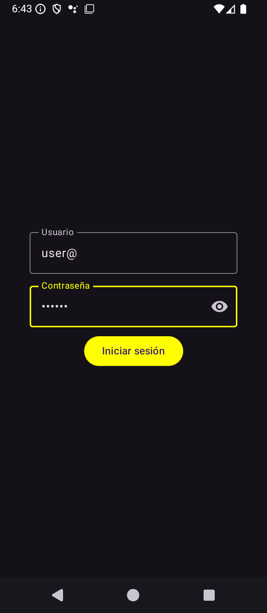
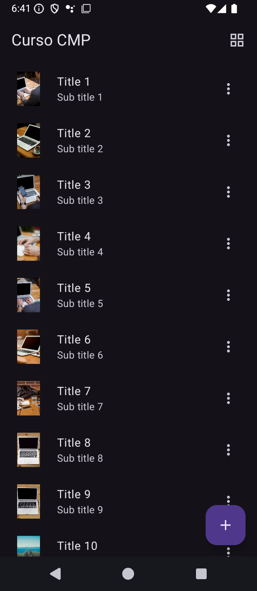

# Compose Multiplatform Course

## Description

This is a demonstration application developed with Kotlin Multiplatform and Compose Multiplatform, which allows sharing code and UI between Android and iOS platforms. The application includes features such as:

- Login screen with validation
- List and grid view of items
- Navigation between screens
- Item details
- Actions like cloning and deleting items

## Project Structure

* `/composeApp` - Code shared across platforms
  - `commonMain` - Code that's common for all platforms
  - `androidMain` - Android-specific code
  - `iosMain` - iOS-specific code
  - `commonTest` - Shared unit tests

* `/iosApp` - Entry point for the iOS application

## Features

- **MVVM Architecture**: Uses ViewModels to separate business logic from UI
- **Navigation**: Implements navigation between screens with parameters
- **Adaptive UI**: Supports list and grid views
- **Internationalization**: Localized text resources
- **Unit Testing**: Includes tests for key components like the password field

## Screens 

- Login 
- List  
- Detail 

## Technologies Used

- Kotlin Multiplatform
- Compose Multiplatform
- Material 3
- Ktor for networking
- Coil for image loading
- Kotlin Serialization